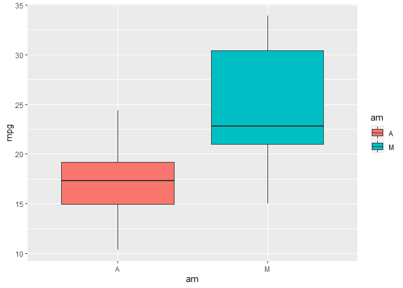
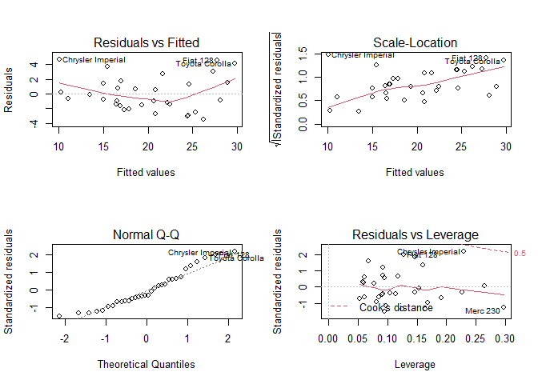

## Executive Summary
In this study we look at the cars dataset comprising of different aspects of automobile design for 32 automobiles, to explore the relationship between these aspects with the miles per gallon. We specifically focus on the following two questions being is an automatic or manual transmission better for MPG and how to quantify this MPG difference between automatic and manual transmissions.

To achieve our objectives we take the following steps:

- Data preprocessing
- Exploratory Analysis
- Model Selection
- Model Examination
- Conclusion

## Data Preprocessing

First, we change the 'am' variable of the dataset which denotes if a car is automatic or manual transmission to a factor variable. We also other variables factor just as to make them discrete instead of continuous.


```r
data("mtcars")
data <- mtcars
data$am <- as.factor(data$am)
levels(data$am) <- c("A", "M") 
data$cyl <- as.factor(data$cyl)
data$gear <- as.factor(data$gear)
data$vs <- as.factor(data$vs)
levels(data$vs) <- c("V", "S")
```

## Exploratory Analysis

First let's take a look at the dataset itself to know about the fields it contains.


```r
str(data)
```

```
## 'data.frame':	32 obs. of  11 variables:
##  $ mpg : num  21 21 22.8 21.4 18.7 18.1 14.3 24.4 22.8 19.2 ...
##  $ cyl : Factor w/ 3 levels "4","6","8": 2 2 1 2 3 2 3 1 1 2 ...
##  $ disp: num  160 160 108 258 360 ...
##  $ hp  : num  110 110 93 110 175 105 245 62 95 123 ...
##  $ drat: num  3.9 3.9 3.85 3.08 3.15 2.76 3.21 3.69 3.92 3.92 ...
##  $ wt  : num  2.62 2.88 2.32 3.21 3.44 ...
##  $ qsec: num  16.5 17 18.6 19.4 17 ...
##  $ vs  : Factor w/ 2 levels "V","S": 1 1 2 2 1 2 1 2 2 2 ...
##  $ am  : Factor w/ 2 levels "A","M": 2 2 2 1 1 1 1 1 1 1 ...
##  $ gear: Factor w/ 3 levels "3","4","5": 2 2 2 1 1 1 1 2 2 2 ...
##  $ carb: num  4 4 1 1 2 1 4 2 2 4 ...
```

```r
head(data, n = 5)
```

```
##                    mpg cyl disp  hp drat    wt  qsec vs am gear carb
## Mazda RX4         21.0   6  160 110 3.90 2.620 16.46  V  M    4    4
## Mazda RX4 Wag     21.0   6  160 110 3.90 2.875 17.02  V  M    4    4
## Datsun 710        22.8   4  108  93 3.85 2.320 18.61  S  M    4    1
## Hornet 4 Drive    21.4   6  258 110 3.08 3.215 19.44  S  A    3    1
## Hornet Sportabout 18.7   8  360 175 3.15 3.440 17.02  V  A    3    2
```

To see the relationship between the mpg and am more clearly lets create a boxplot.


```r
library(ggplot2)
g <- ggplot(data, aes(am, mpg))
g <- g + geom_boxplot(aes(fill = am))
print(g)
```

<!-- -->

The plot clearly shows that cars with manual transmission do have higher mpg as compared to the one's with automatic transmission. However there might be other factors which we might be overlooking. Hence before creating a model we should look at other parameters which have high correlation with the variable. Lets look at all the variables whose correlation with mpg is higher than the am variable.


```r
correlation <- cor(mtcars$mpg, mtcars)
correlation <- correlation[,order(-abs(correlation[1, ]))]
correlation
```

```
##        mpg         wt        cyl       disp         hp       drat         vs 
##  1.0000000 -0.8676594 -0.8521620 -0.8475514 -0.7761684  0.6811719  0.6640389 
##         am       carb       gear       qsec 
##  0.5998324 -0.5509251  0.4802848  0.4186840
```

```r
variables <- names(correlation)[1: which(names(correlation) == "am")]
variables
```

```
## [1] "mpg"  "wt"   "cyl"  "disp" "hp"   "drat" "vs"   "am"
```

## Model Selection

Now that we know mpg variable has stronger correlations with other variables too apart from just am, we can't base our model solely on this one variable as it will not be the most accurate one. Let's start this process by fitting mpg with just am.


```r
first <- lm(mpg ~ am, data)
summary(first)
```

```
## 
## Call:
## lm(formula = mpg ~ am, data = data)
## 
## Residuals:
##     Min      1Q  Median      3Q     Max 
## -9.3923 -3.0923 -0.2974  3.2439  9.5077 
## 
## Coefficients:
##             Estimate Std. Error t value Pr(>|t|)    
## (Intercept)   17.147      1.125  15.247 1.13e-15 ***
## amM            7.245      1.764   4.106 0.000285 ***
## ---
## Signif. codes:  0 '***' 0.001 '**' 0.01 '*' 0.05 '.' 0.1 ' ' 1
## 
## Residual standard error: 4.902 on 30 degrees of freedom
## Multiple R-squared:  0.3598,	Adjusted R-squared:  0.3385 
## F-statistic: 16.86 on 1 and 30 DF,  p-value: 0.000285
```

In this case p-value is quite low but the R-squared value is the real problem. Hence, let's now go to the other extreme end and fit all variables with mpg.


```r
last <- lm(mpg ~ ., data)
summary(last)
```

```
## 
## Call:
## lm(formula = mpg ~ ., data = data)
## 
## Residuals:
##     Min      1Q  Median      3Q     Max 
## -3.2015 -1.2319  0.1033  1.1953  4.3085 
## 
## Coefficients:
##             Estimate Std. Error t value Pr(>|t|)  
## (Intercept) 15.09262   17.13627   0.881   0.3895  
## cyl6        -1.19940    2.38736  -0.502   0.6212  
## cyl8         3.05492    4.82987   0.633   0.5346  
## disp         0.01257    0.01774   0.708   0.4873  
## hp          -0.05712    0.03175  -1.799   0.0879 .
## drat         0.73577    1.98461   0.371   0.7149  
## wt          -3.54512    1.90895  -1.857   0.0789 .
## qsec         0.76801    0.75222   1.021   0.3201  
## vsS          2.48849    2.54015   0.980   0.3396  
## amM          3.34736    2.28948   1.462   0.1601  
## gear4       -0.99922    2.94658  -0.339   0.7382  
## gear5        1.06455    3.02730   0.352   0.7290  
## carb         0.78703    1.03599   0.760   0.4568  
## ---
## Signif. codes:  0 '***' 0.001 '**' 0.01 '*' 0.05 '.' 0.1 ' ' 1
## 
## Residual standard error: 2.616 on 19 degrees of freedom
## Multiple R-squared:  0.8845,	Adjusted R-squared:  0.8116 
## F-statistic: 12.13 on 12 and 19 DF,  p-value: 1.764e-06
```

Here R-squared values have definitely improved but the p-value becomes the problem now which is caused most probably due to overfitting. So, lets use 'step' method to iterate over the variables and obtain the best model.


```r
best <- step(last, direction = "both", trace = FALSE)
summary(best)
```

```
## 
## Call:
## lm(formula = mpg ~ wt + qsec + am, data = data)
## 
## Residuals:
##     Min      1Q  Median      3Q     Max 
## -3.4811 -1.5555 -0.7257  1.4110  4.6610 
## 
## Coefficients:
##             Estimate Std. Error t value Pr(>|t|)    
## (Intercept)   9.6178     6.9596   1.382 0.177915    
## wt           -3.9165     0.7112  -5.507 6.95e-06 ***
## qsec          1.2259     0.2887   4.247 0.000216 ***
## amM           2.9358     1.4109   2.081 0.046716 *  
## ---
## Signif. codes:  0 '***' 0.001 '**' 0.01 '*' 0.05 '.' 0.1 ' ' 1
## 
## Residual standard error: 2.459 on 28 degrees of freedom
## Multiple R-squared:  0.8497,	Adjusted R-squared:  0.8336 
## F-statistic: 52.75 on 3 and 28 DF,  p-value: 1.21e-11
```

Here the R-squared value is pretty good and also p-values are quite significant. Hence undoubtedly this is the best fit for us.

## Model Examination

The best model we obtained i.e., 'best' depicts the dependance of mpg over wt and qsec other than am. Let's plot and study some residual plots to understand more about the 'best' fit. 


```r
layout(matrix(c(1,2,3,4),2,2))
plot(best)
```

<!-- -->

## Conclusion

The first question whether automatic or manual is better for mpg can be answered using all the models created as holding all the other parameters constant, manual transmission increases the mpg.

However the second question is a little difficult to answer.
Based on 'best' fit model, we conclude that cars with manual transmission have 2.93 more mpg than that of automatic with p < 0.05 and R-squared 0.85.

Residuals vs Fitted plot however shows something is missing from the model which might be a problem due to a small sample size which is 32 observations. Even though the conclusion that manual has better performance with respect to mpg, whether the model will git all future observations will be doubtful.
